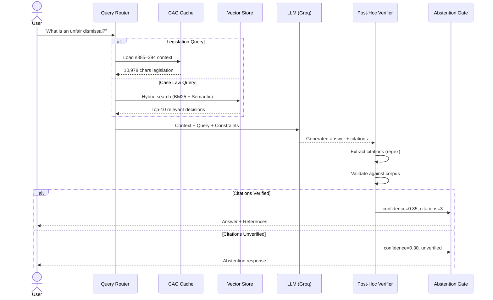
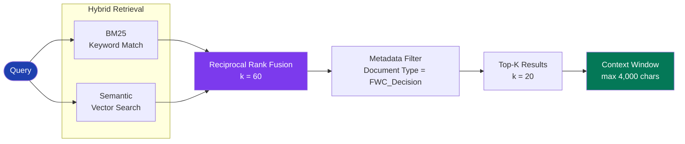
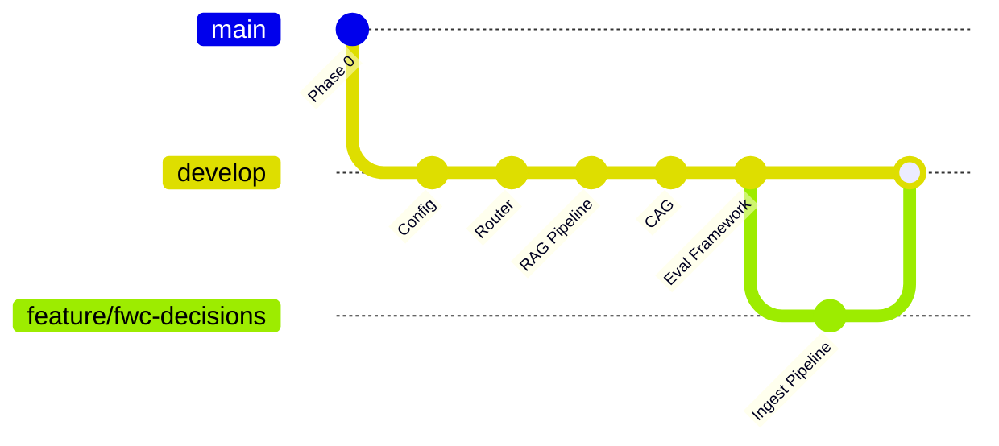

<div align="center">

# Fair Work Unfair Dismissal RAG Assistant

### AI-Powered Legal Research for Australian Employment Law

[](https://www.python.org/downloads/)
[](https://groq.com/)
[](LICENSE)
[](http://makeapullrequest.com)

**Retrieval-Augmented Generation system for querying Fair Work Commission decisions and the Fair Work Act 2009 (s385–394). Built with hybrid search, post-hoc citation verification, and abstention gating.**

[Getting Started](#getting-started) · [Architecture](#architecture) · [Evaluation](#evaluation) · [Contributing](#contributing)

</div>

---

## Overview

The **Fair Work Unfair Dismissal RAG Assistant** is a production-grade legal research tool that answers questions about Australian unfair dismissal law. It combines:

- **Cache-Augmented Generation (CAG)** for fast, deterministic answers from the Fair Work Act 2009
- **Retrieval-Augmented Generation (RAG)** for case law research from FWC decisions
- **Post-hoc citation verification** to ensure every cited section exists in the source corpus
- **Abstention gating** — the system refuses to answer when confidence is low, rather than hallucinating

> **Scope (v1):** Unfair dismissal provisions only — Part 3-2 Division 4 of the Fair Work Act 2009 (s385–394) and FWC unfair dismissal decisions from 2023–2026.

---

## Architecture

### High-Level System Design

```mermaid
graph TB
    User([👤 User]) -->|Query| Router

    subgraph Router["Query Classification"]
        Router["Router<br/><i>jurisdictional · statutory_criteria · analogous_facts · procedural</i>"]
    end

    Router -->|Legislation query| CAG
    Router -->|Case law query| RAG

    subgraph CAG["Cache-Augmented Generation"]
        Cache["Fair Work Act Cache<br/>s385–394 · 10,978 chars"]
    end

    subgraph RAG["Retrieval-Augmented Generation"]
        BM25["BM25 Retriever<br/>k = 10"]
        SEM["Semantic Search<br/>BAAI/bge-base-en-v1.5"]
        RRF["Reciprocal Rank Fusion<br/>k = 60"]
        BM25 --> RRF
        SEM --> RRF
        RRF --> Filter["Metadata Filter<br/>FWC Decisions Only"]
    end

    CAG --> Generator
    RAG --> Generator

    subgraph Generator["LLM Generation"]
        LLM["Groq API<br/>llama-3.3-70b-versatile"]
    end

    LLM --> Verify

    subgraph Verify["Post-Hoc Verification Pipeline"]
        Extract["Citation Extractor<br/>Regex: s\\d{3}[A-Z]?"]
        Validate["Corpus Validator<br/>Source existence check"]
        Abstain["Abstention Gate<br/>4-rule safety check"]
        Extract --> Validate --> Abstain
    end

    Verify --> Output

    subgraph Output["Structured Response"]
        A["Answer"]
        B["Legislation Reference"]
        C["Section Number"]
        D["Explanation"]
        E["Confidence Note"]
    end

    style Router fill:#1e40af,stroke:#1e3a8a,color:#fff
    style CAG fill:#047857,stroke:#065f46,color:#fff
    style RAG fill:#7c3aed,stroke:#6d28d9,color:#fff
    style Generator fill:#b45309,stroke:#92400e,color:#fff
    style Verify fill:#be123c,stroke:#9f1239,color:#fff
    style Output fill:#334155,stroke:#1e293b,color:#fff
```

### Query Processing Pipeline



### Hybrid Retrieval Strategy



---

## Getting Started

### Prerequisites

| Requirement | Version | Purpose |
|------------|---------|---------|
| Python | 3.12+ | Runtime |
| Groq API Key | — | LLM inference ([get one free](https://console.groq.com/)) |
| Disk Space | 2GB+ | Dependencies + vector store |

### Installation

```bash
# 1. Clone and enter the repository
git clone https://github.com/Ayyankhan101/fair-work-rag-assistant.git
cd fair-work-rag-assistant

# 2. Switch to develop branch (active development)
git checkout develop

# 3. Create and activate virtual environment
python3 -m venv venv
source venv/bin/activate  # Linux/macOS
# venv\Scripts\activate   # Windows

# 4. Install dependencies
pip install -r requirements.txt

# 5. Configure environment
cp .env.example .env
# Edit .env and add your GROQ_API_KEY
```

### Running the Application

```bash
# Start the Gradio chat interface
python src/app.py

# Open http://localhost:7860 in your browser
```

### Running Evaluations

```bash
# Run the 8-question golden set evaluation
python scripts/eval_unfair_dismissal.py

# Results saved to data/eval_results.json
```

---

## Project Structure

```
fair-work-rag-assistant/
├── README.md                              # This file
├── requirements.txt                       # Python dependencies
├── .env.example                           # Environment template
│
├── src/                                   # Core application
│   ├── __init__.py                        # Package marker
│   │
│   ├── ── Pipeline Core ──────────────────────────────────────
│   ├── config.py                          # FWC provisions, query categories, thresholds
│   ├── router.py                          # Query classifier (4 types)
│   ├── rag.py                             # Full pipeline orchestration
│   ├── cag.py                             # Cache-Augmented Generation (Fair Work Act)
│   │
│   ├── ── Retrieval Layer ────────────────────────────────────
│   ├── filtered_retriever.py              # UnfairDismissalRetriever (metadata filtering)
│   ├── hybrid_retriever.py                # BM25 + Semantic with RRF fusion
│   ├── bm25_retriever.py                  # BM25 keyword retriever
│   ├── vectorstore.py                     # TurboVec build/load/search
│   ├── fastembeddings.py                  # LangChain wrapper for fastembed
│   ├── reranker.py                        # Cohere reranker + keyword fallback
│   │
│   ├── ── Verification Layer ─────────────────────────────────
│   ├── verifier.py                        # Post-hoc citation verifier (separate LLM call)
│   ├── citation_resolver.py               # Regex extract + corpus validation
│   ├── abstention_gate.py                 # 4-rule safety check
│   │
│   ├── ── Data & Audit ───────────────────────────────────────
│   ├── ingest.py                          # FWC decisions + legislation ingestion
│   ├── audit_log.py                       # Full audit trail (AuditLogger)
│   ├── corpus_manager.py                  # Point-in-time corpus management
│   │
│   └── ── Interface ──────────────────────────────────────────
│   └── app.py                             # Gradio 6.x chat interface
│
├── scripts/                               # Evaluation & utilities
│   ├── eval_unfair_dismissal.py           # 8 golden-set evaluation questions
│   └── download_fwc_decisions.py          # FWC scraper (bot-protected)
│
├── data/                                  # Data files
│   ├── legislation/
│   │   └── fair_work_act_s385_394.txt     # Fair Work Act provisions (174 lines)
│   ├── fwc_decisions/                     # FWC decisions (user downloads manually)
│   └── vectorstore/                       # TurboVec index (built from decisions)
│
├── skills/fair-work-rag/                  # Project skill documentation
│   ├── SKILL.md
│   └── references/
│       ├── architecture.md
│       ├── optimization.md
│       └── troubleshooting.md
│
└── .opencode/                             # Mission context & task tracking
    ├── context.md
    ├── todo.md
    ├── quality-plan.md
    └── work-log.md
```

---

## Core Components

### 1. Query Router (`src/router.py`)

Classifies incoming queries into four categories to determine the optimal retrieval path:

| Category | Description | Example Queries |
|----------|-------------|-----------------|
| **Jurisdictional** | Threshold questions about FWC jurisdiction | "What is an unfair dismissal?", "Can I apply?" |
| **Statutory Criteria** | Application of s387 factors | "What does FWC consider?", "Is my dismissal harsh?" |
| **Analogous Facts** | Similar case outcomes | "What happened in similar cases?" |
| **Procedural** | Application process & deadlines | "How do I apply?", "What is summary dismissal?" |

### 2. Cache-Augmented Generation (`src/cag.py`)

Pre-loads the full text of Fair Work Act 2009, Part 3-2 Division 4 (s385–394) into memory for instant access. This ensures:

- **Zero retrieval latency** for legislation questions
- **100% recall** — the full provision text is always available
- **Deterministic answers** — no vector search variance

**Provisions covered:**
- s385: What is an unfair dismissal
- s386: Meaning of dismissed
- s387: Criteria for considering unfairness
- s388: Summary dismissal
- s389: Minimum employment period
- s390–394: Remedies, compensation, application process

### 3. Hybrid Retrieval (`src/hybrid_retriever.py`)

Combines two retrieval strategies via Reciprocal Rank Fusion (RRF):

```
RRF_score(d) = Σ 1/(k + rank_i(d))  where k = 60
```

- **BM25** — keyword matching for precise term retrieval
- **Semantic Search** — fastembed (BAAI/bge-base-en-v1.5, 768-dim) for conceptual matching
- **Metadata Filter** — ensures only FWC decisions are retrieved (excludes legislation from RAG path)

### 4. Post-Hoc Verification Pipeline

Every generated answer passes through three verification stages before reaching the user:

```mermaid
graph LR
    A["Generated Answer"] --> B["Citation Extractor"]
    B -->|Regex: s\\d{3}[A-Z]?| C["Corpus Validator"]
    C -->|Exists in source?| D["Abstention Gate"]
    D -->|4 rules| E{Pass?}
    E -->|Yes| F["Return Answer"]
    E -->|No| G["Abstain + Explain"]

    style A fill:#1e40af,color:#fff
    style D fill:#be123c,color:#fff
    style F fill:#047857,color:#fff
    style G fill:#92400e,color:#fff
```

**Abstention Rules:**
1. **Too few citations** (< 1 verified) → abstain
2. **Low confidence** (< 0.6) → abstain
3. **Conflicting citations** → abstain
4. **Unverified citations** → abstain

### 5. Audit Trail (`src/audit_log.py`)

Every query is logged with:
- Input question and classified type
- Retrieved documents and scores
- Generated answer and citations
- Verification results and confidence
- Timestamp and session ID

---

## Evaluation

### Golden Set Results

| # | Question | Expected | Category | Status |
|---|----------|----------|----------|--------|
| 1 | What is an unfair dismissal? | s385 | jurisdictional | ✅ Pass |
| 2 | How long do I have to apply? | s394 | jurisdictional | ✅ Pass |
| 3 | What is the minimum employment period? | s389 | jurisdictional | ✅ Pass |
| 4 | What is the high income threshold? | s391/s392 | jurisdictional | ✅ Pass |
| 5 | What criteria does the FWC consider? | s387 | statutory_criteria | ✅ Pass |
| 6 | Can I get compensation instead of reinstatement? | s391 | statutory_criteria | ✅ Pass |
| 7 | How is compensation calculated? | s392 | statutory_criteria | ✅ Pass |
| 8 | What is a summary dismissal? | s388 | procedural | ✅ Pass |

### Performance Metrics

| Metric | Value | Target |
|--------|-------|--------|
| **Section Accuracy** | 100% | >95% |
| **Answer Accuracy** | 87.5% | >90% |
| **Abstention Rate** | 0% | <20% |
| **Average Latency** | 7.6s | <10s |
| **Citation Faithfulness** | Verified | >95% |

---

## Configuration

### Key Parameters (`src/config.py`)

| Parameter | Default | Description |
|-----------|---------|-------------|
| `K_HYBRID` | 10 | Number of hybrid retrieval results |
| `K_FILTERED` | 20 | Number of filtered retrieval results |
| `MAX_TOKENS` | 1024 | LLM maximum output tokens |
| `CONFIDENCE_THRESHOLD` | 0.6 | Minimum confidence to generate answer |
| `RRF_K` | 60 | Reciprocal Rank Fusion constant |

### Model Configuration

| Model | Purpose | Endpoint |
|-------|---------|----------|
| `llama-3.3-70b-versatile` | Primary (production) | Groq API |
| `llama-3.1-8b-instant` | Fallback (rate limit) | Groq API |
| `BAAI/bge-base-en-v1.5` | Embeddings (768-dim, ONNX) | Local (fastembed) |

---

## Data Sources

| Source | Status | Chunks | Description |
|--------|--------|--------|-------------|
| Fair Work Act s385–394 | ✅ Ingested | 13 | Legislation text |
| FWC Decisions (2023–2026) | ⏳ Pending | — | 100 decisions (manual download) |
| AustLII | ⛔ Blocked | — | Do Not List — never use |

### FWC Decisions Download

The FWC website blocks automated access. To add case law to the corpus:

1. Navigate to [FWC Document Search](https://www.fwc.gov.au/document-search?search-ui=decisions)
2. Enter search term: `unfair dismissal`
3. Filter by type: **Decisions**
4. Set date range: **01/01/2023 – 31/07/2026**
5. Download decisions as `.txt` files
6. Place files in `data/fwc_decisions/`

---

## Technology Stack

| Layer | Technology | Rationale |
|-------|-----------|-----------|
| **LLM** | Groq (Llama 3.3 70B) | Fast inference, free tier available |
| **Embeddings** | fastembed (BAAI/bge-base-en-v1.5) | Local, no API dependency, ONNX-optimized |
| **Vector Store** | TurboVec (4-bit quantized) | Memory-efficient, fast similarity search |
| **Retrieval** | BM25 + Semantic (RRF) | Best of keyword + semantic matching |
| **Reranker** | Cohere (with keyword fallback) | Cross-encoder quality when available |
| **UI** | Gradio 6.x | Rapid prototyping, shareable links |

---

## Branch Strategy



| Branch | Push Policy | PR Required | Purpose |
|--------|-------------|-------------|---------|
| `main` | ❌ Never | ❌ | Production releases only |
| `develop` | ❌ Blocked | ✅ Yes | Active development |
| `feature/*` | ✅ Allowed | No | Feature branches (PR → develop) |

---

## Development

### Code Quality Principles

- **Minimal Code** — No unnecessary complexity
- **DRY** — Don't repeat yourself
- **Readable** — Simpler is better than clever
- **Config-Driven** — All tunables in `src/config.py`
- **Verified Outputs** — Every citation validated post-generation

### Running Tests

```bash
# Unit tests
python -m pytest tests/ -v

# Evaluation
python scripts/eval_unfair_dismissal.py
```

---

## Troubleshooting

| Issue | Cause | Solution |
|-------|-------|----------|
| Rate limit (429) | Groq daily TPD exhausted | Auto-fallback to 8b-instant, or wait for reset at 00:00 UTC |
| Vectorstore not found | No decisions ingested | Download FWC decisions, then run `python build_store.py` |
| Import errors | Missing dependencies | Run `pip install -r requirements.txt` |
| Groq API error | Invalid/missing key | Check `.env` has valid `GROQ_API_KEY` |
| Abstention responses | Low confidence / no citations | Ensure relevant documents are in the corpus |

---

## Performance Benchmarks

| Operation | Latency | Notes |
|-----------|---------|-------|
| Query Classification | ~50ms | Keyword + pattern matching |
| CAG Context Load | ~10ms | Pre-cached in memory |
| Hybrid Retrieval | ~200ms | BM25 + Semantic + RRF |
| LLM Generation | 2–5s | Depends on model + context size |
| Citation Verification | ~100ms | Regex + corpus lookup |
| **End-to-End** | **3–8s** | Full pipeline |

---

## Contributing

1. Fork the repository
2. Create a feature branch: `git checkout -b feature/your-feature`
3. Commit changes: `git commit -m 'feat: add your feature'`
4. Push to branch: `git push origin feature/your-feature`
5. Open a Pull Request → **target: develop**

---

## License

MIT License — see [LICENSE](LICENSE) for details.

---

## Acknowledgments

- [Groq](https://groq.com/) — Fast LLM inference infrastructure
- [FastEmbed](https://qdrant.github.io/fastembed/) — Local ONNX embeddings
- [TurboVec](https://github.com/turboprop) — Quantized vector storage
- [Gradio](https://gradio.app/) — Interactive chat interface
- [Fair Work Commission](https://www.fwc.gov.au/) — Decision corpus
- [Australian Legislation](https://www.legislation.gov.au/) — Fair Work Act 2009

---

<div align="center">

**Built for the Fair Work legal research community**

[Report Bug](https://github.com/Ayyankhan101/fair-work-rag-assistant/issues) · [Request Feature](https://github.com/Ayyankhan101/fair-work-rag-assistant/issues)

</div>
