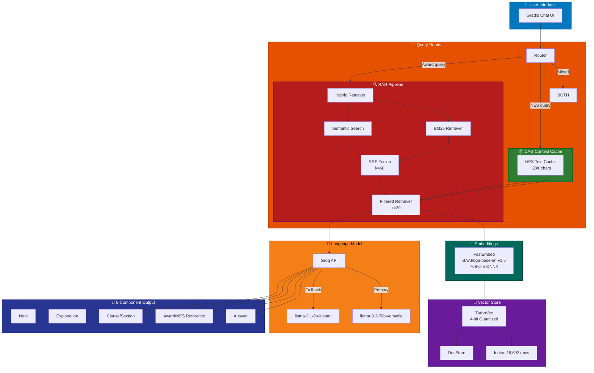
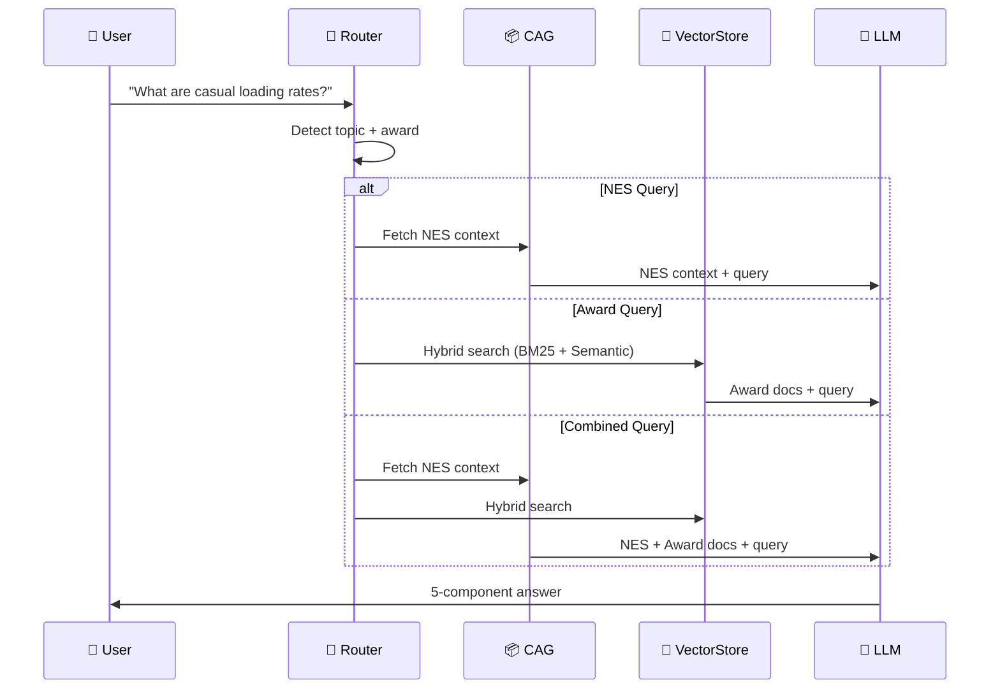
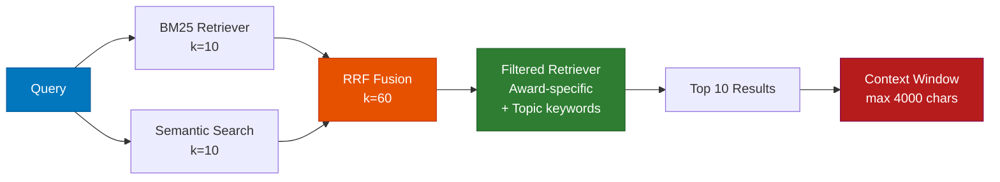

# 🏛️ Fair Work Awards & NES Knowledge Assistant

> RAG-powered LLM assistant for Australian employment law — 130 Modern Awards + National Employment Standards

[](https://www.python.org/downloads/)
[](https://anthropic.com/)
[](LICENSE)

---

## 📊 Architecture Overview



---

## 🚀 Quick Start

### Prerequisites

- Python 3.11+
- Groq API key ([Get one here](https://console.groq.com/))
- 2GB+ free disk space

### Installation

```bash
# Clone the repo
git clone https://github.com/Ayyankhan101/fair-work-rag-assistant.git
cd fair-work-rag-assistant

# Switch to develop branch (full codebase)
git checkout develop

# Create virtual environment
python3 -m venv venv
source venv/bin/activate  # Linux/Mac
# or: venv\Scripts\activate  # Windows

# Install dependencies
pip install -r requirements.txt

# Configure API key
cp .env.example .env
# Edit .env and add your GROQ_API_KEY
```

### Run the App

```bash
venv/bin/python3 src/app.py
# Open http://localhost:7860 in your browser
```

### Run Evaluation

```bash
# Hard eval (25 questions with content scoring)
venv/bin/python3 scripts/eval_hard.py

# Basic eval (12 questions)
venv/bin/python3 scripts/eval_prd_questions.py
```

---

## 🏗️ Architecture Details

### Hybrid CAG+RAG System

| Component | Purpose | Technology |
|-----------|---------|------------|
| **CAG** | NES-specific questions (100% recall) | Pre-loaded text cache (~28K chars) |
| **RAG** | Award-specific questions | TurboVec + Hybrid retrieval |
| **Router** | Classifies incoming queries | Pattern matching + keyword detection |

### Query Flow



### Retrieval Pipeline



---

## 📁 Project Structure

```
fair-work-rag-assistant/
├── 📄 README.md                    # This file
├── 📄 requirements.txt             # Python dependencies
├── 📄 .env.example                 # Environment template
├── 📄 build_store.py               # Vectorstore builder (resumable)
│
├── 📂 src/                         # Core application code
│   ├── 🐍 config.py                # Shared config (patterns, keywords)
│   ├── 🐍 rag.py                   # RAG chain + improved prompt
│   ├── 🐍 cag.py                   # CAG context cache (NES)
│   ├── 🐍 router.py                # Query router (CAG/RAG/Combined)
│   ├── 🐍 filtered_retriever.py    # Award-specific retrieval
│   ├── 🐍 hybrid_retriever.py      # BM25 + Semantic with RRF
│   ├── 🐍 bm25_retriever.py        # BM25 retriever
│   ├── 🐍 vectorstore.py           # TurboVec build/load/search
│   ├── 🐍 fastembeddings.py        # LangChain wrapper for fastembed
│   ├── 🐍 ingest.py                # PDF ingestion pipeline
│   └── 🐍 app.py                   # Gradio chat interface
│
├── 📂 scripts/                     # Evaluation & utilities
│   ├── 🐍 eval_hard.py             # 25 hard eval questions
│   ├── 🐍 eval_prd_questions.py    # 12 basic questions
│   └── 🐍 rename_pdfs.py           # PDF rename utility
│
├── 📂 data/                        # Data files
│   ├── 📂 awards/                  # 130 award PDFs (gitignored)
│   ├── 📂 nes/                     # NES text files
│   │   └── 📄 nes_combined.txt     # Full NES (~28K chars)
│   ├── 📂 vectorstore/             # TurboVec index (LFS)
│   │   ├── 📄 index.tvim           # Vector index
│   │   └── 📄 docstore.json        # Document store
│   ├── 📄 docs_cache.pkl           # Cached ingested docs (LFS)
│   ├── 📄 hard_eval_results.json   # Latest eval results
│   └── 📄 prd_eval_results.json    # Basic eval results
│
├── 📂 skills/fair-work-rag/        # Project skill
│   ├── 📄 SKILL.md                 # Skill documentation
│   ├── 📂 assets/
│   │   └── 📄 prompt_template.txt  # LLM prompt template
│   ├── 📂 references/
│   │   ├── 📄 architecture.md      # Architecture docs
│   │   ├── 📄 optimization.md      # Optimization guide
│   │   └── 📄 troubleshooting.md   # Common issues
│   └── 📂 scripts/
│       └── 🐍 run_eval.py          # Eval runner
│
├── 📂 Cortex-insight-analytics/    # Obsidian vault (18 notes)
│   ├── 📄 Project Overview.md
│   ├── 📄 Key Files.md
│   ├── 📄 Architecture Decision.md
│   └── 📄 ... (15 more notes)
│
└── 📂 .opencode/                   # Mission context
    ├── 📄 context.md               # Project context
    ├── 📄 todo.md                   # Task tracking
    └── 📄 work-log.md              # Work log
```

---

## 🎯 Evaluation

### Scoring System

| Component | Weight | Description |
|-----------|--------|-------------|
| **Keywords** | 40% | Must-include terms (synonyms accepted) |
| **Pattern** | 30% | Structural requirements (numbers, clauses) |
| **Quality** | 30% | Completeness and accuracy |

### Current Results

| Metric | Value |
|--------|-------|
| **Accuracy** | 87.5% (23/25 pass) |
| **Questions** | 25 hard questions |
| **Scoring** | Content-based (not exact match) |

### Running Eval

```bash
# Full eval with detailed output
venv/bin/python3 scripts/eval_hard.py

# Results saved to
data/hard_eval_results.json
```

---

## 🔧 Configuration

### Key Parameters (`src/config.py`)

| Parameter | Value | Description |
|-----------|-------|-------------|
| `K_HYBRID` | 10 | Hybrid retrieval results |
| `K_FILTERED` | 20 | Filtered retrieval results |
| `MAX_TOKENS` | 1024 | LLM max output tokens |
| `DOC_CHARS` | 800 | Doc truncation limit |
| `MAX_CHARS` | 4000 | Total context limit |

### Model Configuration

```python
# Primary model (production)
model = "llama-3.3-70b-versatile"

# Fallback model (rate limit)
model = "llama-3.1-8b-instant"
```

---

## 📚 Data Sources

| Source | Count | Size | Description |
|--------|-------|------|-------------|
| **Modern Awards** | 130 | ~133MB PDFs | All Australian awards |
| **NES** | 1 | ~28K chars | National Employment Standards |
| **Vector Store** | 16,692 docs | ~31MB | Indexed chunks |

---

## 🛠️ Development

### ⛔ Branch Rules (CRITICAL)

| Branch | Direct Push | PR Required | Notes |
|--------|-------------|-------------|-------|
| `main` | ❌ **NEVER TOUCH** | ❌ | Owner only - do not touch unless asked |
| `develop` | ❌ Blocked | ✅ Yes | All development happens here |
| `feature/*` | ✅ Allowed | No | Create PR to merge into develop |

### Quick PR (Recommended)

```bash
# Make changes, then run:
./scripts/auto-pr.sh "feat: add new award support"

# This will:
# 1. Create branch: feature/add-new-award-support-{timestamp}
# 2. Commit changes
# 3. Push branch
# 4. Create PR to develop
# 5. Auto-merge if no conflicts
```

### Manual PR Flow

1. Fork the repo
2. Create feature branch: `git checkout -b feature/amazing-feature`
3. Commit changes: `git commit -m 'Add amazing feature'`
4. Push to branch: `git push origin feature/amazing-feature`
5. Open Pull Request → **target: develop**

### Code Quality

- **DRY**: Minimal code, no unnecessary complexity
- **Readable**: Smaller version preferred over clever solutions
- **Config-driven**: All patterns in `src/config.py`

---

## 🐛 Troubleshooting

| Issue | Solution |
|-------|----------|
| **Rate limit (429)** | Auto-fallback to 8b-instant, or wait for daily reset |
| **Vectorstore not found** | Run `venv/bin/python3 build_store.py` |
| **Import errors** | Ensure `pip install -r requirements.txt` |
| **Groq API error** | Check `.env` has valid `GROQ_API_KEY` |

---

## 📈 Performance

- **Retrieval**: ~200ms (hybrid search)
- **LLM Response**: ~2-5s (depending on model)
- **Total Latency**: ~3-7s per query

---

## 📄 License

MIT License - see [LICENSE](LICENSE) for details.

---

## 🙏 Acknowledgments

- [Groq](https://groq.com/) for fast LLM inference
- [FastEmbed](https://qdrant.github.io/fastembed/) for local embeddings
- [TurboVec](https://github.com/turboprop) for quantized vector storage
- [Gradio](https://gradio.app/) for the chat interface

---


